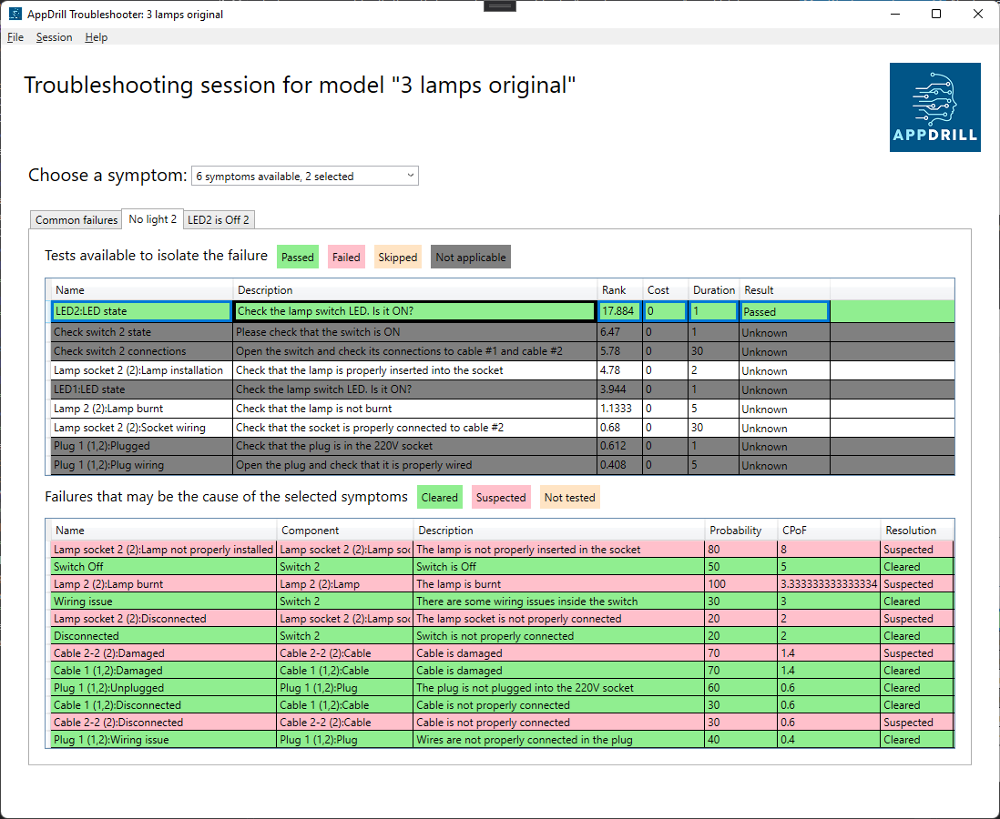

# AppDrill WPF sample program
This is a sample program that shows how to use the AppDrill C# SDK.

The program leverage multiple APIs to show the use of the SDK:
* Establishing and managing sessions
* Client settings management
* Updating test results
* Managing and displaying troubleshooting data

