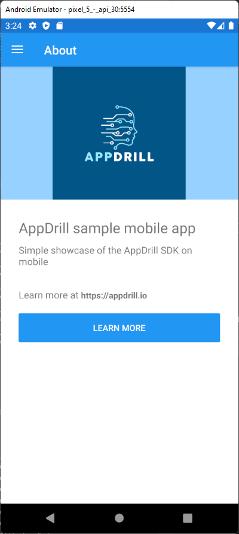

# AppDrill mobile sample program
This is a sample program that shows how to use the AppDrill C# SDK within a Xamarin solution environment.

The sample contains both Android and iOS apps.

Note that this program is based off of the default Visual Studio Xamarin.Forms mobile app code.

